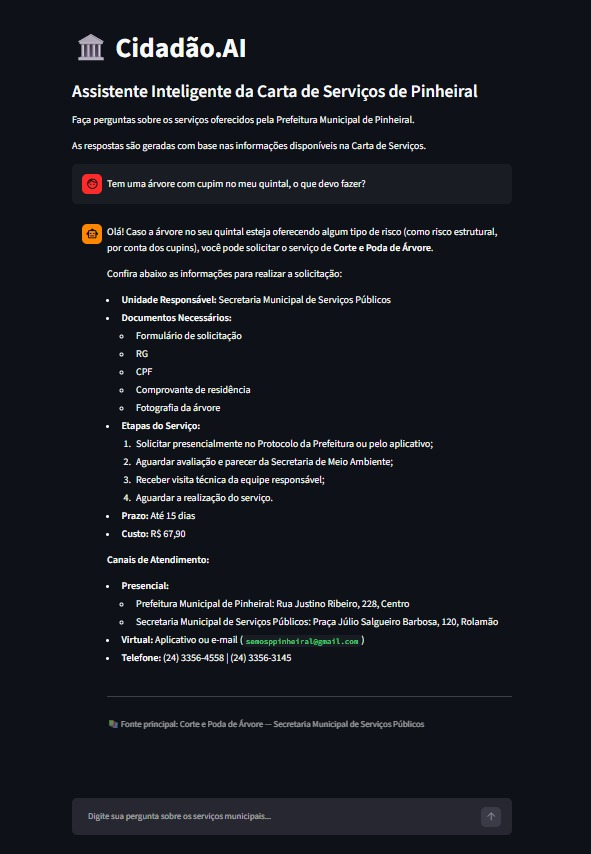
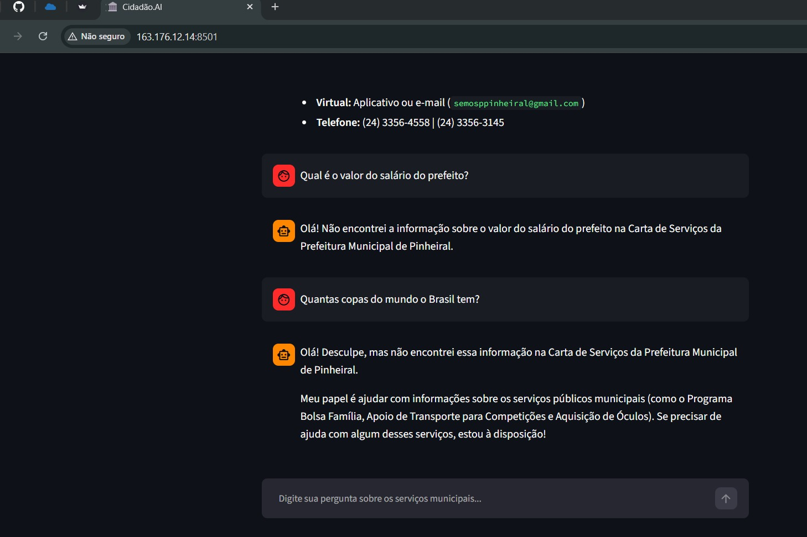

# 🤖 Cidadão.AI

Assistente inteligente baseado em **RAG (Retrieval-Augmented Generation)** para consulta à Carta de Serviços da Prefeitura Municipal de Pinheiral - RJ.

O projeto permite que cidadãos façam perguntas em linguagem natural sobre serviços públicos municipais e recebam respostas baseadas nas informações oficiais disponíveis na Carta de Serviços.

---

## 🎯 Objetivo

O Cidadão.AI foi desenvolvido com o objetivo de facilitar o acesso às informações sobre serviços públicos municipais.

O sistema permite responder perguntas como:

- Quais documentos preciso para solicitar poda de uma árvore?
- Como solicitar a retirada de entulho?
- Quanto custa determinado serviço?
- Qual é o prazo para atendimento?
- Onde posso solicitar um serviço?
- Qual secretaria é responsável?

Quando uma informação não está disponível na Carta de Serviços, o agente informa que não encontrou a resposta na base consultada, evitando gerar informações sem fundamento.

---

## 🧠 Como funciona

O projeto utiliza a arquitetura **RAG (Retrieval-Augmented Generation)**.

O funcionamento ocorre, de forma simplificada, nas seguintes etapas:

1. Os dados da Carta de Serviços são carregados e processados.
2. Cada serviço é transformado em um documento para consulta.
3. Os documentos são convertidos em embeddings.
4. Os embeddings são armazenados no banco vetorial ChromaDB.
5. A pergunta do cidadão também é convertida em uma representação vetorial.
6. O sistema realiza uma busca semântica para encontrar os serviços mais relacionados à pergunta.
7. Os documentos recuperados são utilizados como contexto para o modelo Gemini.
8. O modelo gera uma resposta utilizando as informações recuperadas da Carta de Serviços.

---

## 🏗️ Arquitetura RAG

```text
Carta de Serviços
        ↓
Processamento dos dados
        ↓
Documentos LangChain
        ↓
Embeddings
        ↓
ChromaDB
        ↓
Busca semântica
        ↓
Contexto recuperado
        ↓
Google Gemini
        ↓
Resposta ao cidadão
        ↓
Interface Streamlit
```

---

## 🛠️ Tecnologias utilizadas

O projeto utiliza as seguintes tecnologias:

- Python
- LangChain
- LangChain Chroma
- Google Gemini
- Google Generative AI Embeddings
- ChromaDB
- Streamlit
- Python Dotenv
- Pandas
- PyPDF
- Pytest
- Git
- GitHub
- Podman
- systemd / Quadlet
- Oracle Cloud Infrastructure (OCI)
- Oracle Linux 9

> Pandas, PyPDF e Pytest foram utilizados em etapas auxiliares de desenvolvimento, processamento e testes. O ambiente de produção utiliza um conjunto reduzido de dependências.

---

## 📂 Estrutura do projeto

```text
cidadao-ai/
│
├── app/
│   ├── __init__.py
│   ├── main.py
│   └── rag.py
│
├── data/
│   └── servicos_processados.json
│
├── documents/
│   ├── carta_de_servicos.pdf
│   └── carta_servicos.json
│
├── docs/
│   └── evidencias/
│       ├── cidadao-ai-oci.png
│       └── cidadao-ai-resposta-fora-base.png
│
├── scripts/
│   ├── analisar_json.py
│   ├── analisar_dados_pandas.py
│   ├── criar_documentos.py
│   ├── criar_banco_vetorial.py
│   ├── ler_pdf.py
│   ├── preparar_dados.py
│   ├── testar_busca.py
│   ├── testar_embeddings.py
│   ├── testar_gemini.py
│   ├── testar_rag.py
│   └── testes_agente.py
│
├── tests/
│   └── test_busca.py
│
├── .dockerignore
├── .gitignore
├── Dockerfile
├── README.md
└── requirements.txt
```

---

## 📊 Base de conhecimento

A base utilizada pelo agente é composta pela **Carta de Serviços da Prefeitura Municipal de Pinheiral - RJ**.

Atualmente, o conjunto de dados processado contém **138 serviços públicos municipais**.

Entre as informações disponíveis estão:

- título do serviço;
- descrição;
- público-alvo;
- documentos necessários;
- etapas;
- prazo;
- custo;
- canais de atendimento;
- unidade responsável;
- contato;
- legislação;
- palavras-chave.

Essas informações são utilizadas pelo mecanismo de busca semântica para recuperar os serviços mais relacionados à pergunta realizada pelo cidadão.

---

## 🔎 Exemplos de utilização

### Exemplo 1 — Informação encontrada na base

**Pergunta:**

> Tem uma árvore com cupim no meu quintal, o que devo fazer?

O agente identifica semanticamente o serviço relacionado a **Corte e Poda de Árvore** e recupera as informações correspondentes na Carta de Serviços.

**Exemplo de resposta gerada pelo agente:**

> Olá! Caso a árvore no seu quintal esteja oferecendo algum tipo de risco, como risco estrutural por conta dos cupins, você pode solicitar o serviço de **Corte e Poda de Árvore**.
>
> Entre as informações recuperadas estão a unidade responsável, os documentos necessários, as etapas para solicitação, prazo, custo e canais de atendimento.

Esse exemplo demonstra a capacidade de recuperação semântica do sistema, pois o cidadão não precisa conhecer ou utilizar exatamente o nome oficial do serviço presente na Carta de Serviços.

---

### Exemplo 2 — Informação não disponível na base

**Pergunta:**

> Qual é o valor do salário do prefeito?

**Resposta gerada pelo agente:**

> Olá! Não encontrei a informação sobre o valor do salário do prefeito na Carta de Serviços da Prefeitura Municipal de Pinheiral.

Nesse caso, o agente informa que a informação solicitada não está disponível na base utilizada pelo sistema.

---

### Exemplo 3 — Pergunta fora do domínio

**Pergunta:**

> Quantas Copas do Mundo o Brasil tem?

**Exemplo de resposta gerada pelo agente:**

> Olá! Não encontrei essa informação na Carta de Serviços da Prefeitura Municipal de Pinheiral.
>
> Como assistente virtual da Prefeitura, posso ajudar com informações sobre os serviços públicos municipais.

Esse comportamento mantém o agente concentrado no domínio da Carta de Serviços e reduz a geração de respostas sem fundamento na base utilizada.

---

## 🧪 Testes

O projeto possui testes para verificar o funcionamento da recuperação semântica.

Entre as consultas utilizadas durante o desenvolvimento estão perguntas relacionadas a:

- poda de árvores;
- retirada de entulho;
- castração de animais;
- serviços municipais;
- consultas fora do domínio da Carta de Serviços.

Para executar os testes no ambiente de desenvolvimento:

```bash
python -m pytest -v
```

---

## ▶️ Executando o projeto localmente

### 1. Clone o repositório

```bash
git clone https://github.com/IzaCoelho1/cidadao-ai.git
```

Entre na pasta:

```bash
cd cidadao-ai
```

### 2. Crie um ambiente virtual

```bash
python -m venv .venv
```

No Windows PowerShell:

```powershell
.\.venv\Scripts\Activate.ps1
```

No Linux:

```bash
source .venv/bin/activate
```

### 3. Instale as dependências

```bash
pip install -r requirements.txt
```

### 4. Configure a API Key

Crie um arquivo `.env` na raiz do projeto:

```text
GOOGLE_API_KEY=sua_chave_aqui
```

O arquivo `.env` não deve ser enviado para o GitHub.

### 5. Crie o banco vetorial

```bash
python scripts/criar_banco_vetorial.py
```

### 6. Execute a aplicação

```bash
streamlit run app/main.py
```

Por padrão, a aplicação poderá ser acessada em:

```text
http://localhost:8501
```

---

## 🐳 Containerização

O projeto possui um `Dockerfile` para permitir a execução da aplicação em container.

No ambiente de produção foi utilizado **Podman**.

Para construir a imagem:

```bash
podman build -t cidadao-ai .
```

Para executar manualmente:

```bash
podman run -d \
  --name cidadao-ai \
  --env-file .env \
  -p 8501:8501 \
  localhost/cidadao-ai:latest
```

A aplicação utiliza a porta:

```text
8501/TCP
```

---

## ☁️ Deploy na Oracle Cloud Infrastructure

O Cidadão.AI foi implantado na **Oracle Cloud Infrastructure (OCI)** utilizando uma máquina virtual com Oracle Linux 9.

A aplicação é executada em container utilizando Podman e disponibilizada através do Streamlit.

### Infraestrutura utilizada

- Oracle Cloud Infrastructure (OCI)
- Oracle Linux 9
- VM.Standard.E2.1.Micro
- Podman
- systemd
- Quadlet
- Streamlit
- ChromaDB
- Google Gemini

### Arquitetura do deploy

```text
GitHub
   ↓
Oracle Cloud Infrastructure
   ↓
Oracle Linux 9
   ↓
Podman
   ↓
Container Cidadão.AI
   ↓
ChromaDB
   ↓
Google Gemini
   ↓
Streamlit
   ↓
Internet
```

---

## 🌐 Acesso público

A aplicação está disponibilizada através da instância utilizada na Oracle Cloud Infrastructure:

```text
http://163.176.12.14:8501
```

> **Observação:** o endereço público depende da disponibilidade e configuração da instância utilizada na Oracle Cloud Infrastructure.

---

## 📸 Evidências do deploy

### Aplicação executando na Oracle Cloud

A imagem abaixo mostra o Cidadão.AI sendo acessado através do endereço público da instância na Oracle Cloud Infrastructure.

A aplicação recebe uma pergunta em linguagem natural e recupera informações relacionadas ao serviço **Corte e Poda de Árvore**.



### Tratamento de informação não disponível

O agente também foi testado com uma pergunta cuja resposta não está disponível na Carta de Serviços.



Nesse caso, o agente informa que não encontrou a informação solicitada na base utilizada pelo projeto.

---

## 🎥 Demonstração em vídeo

Foi gravada uma demonstração do **Cidadão.AI em funcionamento na Oracle Cloud Infrastructure**.

No vídeo é possível acompanhar a utilização da aplicação através do endereço público, demonstrando o funcionamento do agente e sua interação com a Carta de Serviços.

▶️ **[Assistir à demonstração do Cidadão.AI](https://youtube.com/shorts/mK_1_wtF1hU?feature=share)**

A demonstração apresenta:

- acesso à aplicação implantada na Oracle Cloud Infrastructure;
- interface desenvolvida com Streamlit;
- realização de perguntas em linguagem natural;
- recuperação de informações da Carta de Serviços;
- geração de respostas utilizando RAG;
- comportamento do agente quando a informação solicitada não está disponível na base.

---

## ✅ Validação técnica do deploy

Após a implantação, a aplicação foi validada diretamente na máquina virtual da Oracle Cloud.

Foi realizado o teste:

```bash
curl -I http://127.0.0.1:8501
```

A aplicação respondeu:

```text
HTTP/1.1 200 OK
```

O processo de indexação da base também foi concluído com sucesso:

```text
Banco vetorial criado com sucesso.
Documentos armazenados: 138
```

O container disponibiliza a aplicação através da porta:

```text
0.0.0.0:8501
```

Esses testes confirmam o funcionamento do servidor da aplicação, do container e da base vetorial na infraestrutura da OCI.

---

## 🔄 Execução persistente na OCI

Para que a aplicação permaneça disponível mesmo após o encerramento da sessão SSH, o container é gerenciado pelo **systemd utilizando Podman Quadlet**.

Foi configurado o serviço:

```text
cidadao-ai.service
```

O serviço gerencia o container responsável pela aplicação.

Também foi habilitado o recurso **linger** para o usuário responsável pelo container, permitindo que os serviços do usuário continuem sendo executados mesmo sem uma sessão SSH ativa.

O status do serviço pode ser consultado com:

```bash
systemctl --user status cidadao-ai.service
```

O container pode ser verificado com:

```bash
podman ps
```

---

## 🔐 Segurança

O projeto adota medidas para evitar a exposição de informações sensíveis.

A chave utilizada para acessar a API do Gemini é armazenada no arquivo:

```text
.env
```

O arquivo está incluído no `.gitignore` e não é versionado no repositório.

No servidor, suas permissões também foram limitadas:

```bash
chmod 600 .env
```

A chave da API não é armazenada no `Dockerfile` nem diretamente no código-fonte.

---

## 🚧 Limitações atuais

O projeto foi desenvolvido como uma solução RAG utilizando uma base específica de serviços municipais.

Entre as limitações atuais estão:

- as respostas dependem das informações presentes na Carta de Serviços;
- informações externas à base não são utilizadas para responder às perguntas;
- alterações na Carta de Serviços exigem atualização da base vetorial;
- a disponibilidade pública depende da infraestrutura utilizada para hospedar a aplicação;
- a recuperação vetorial pode encontrar documentos semanticamente próximos mesmo quando a informação solicitada não está presente neles.

---

## 🚀 Melhorias futuras

Como possíveis evoluções do projeto:

- atualização automática da Carta de Serviços;
- persistência otimizada do banco vetorial entre reinicializações;
- melhoria da seleção e exibição das fontes recuperadas;
- ocultação de fontes irrelevantes quando nenhuma resposta é encontrada;
- melhoria da interface do Streamlit;
- utilização de domínio próprio e HTTPS;
- monitoramento da aplicação;
- ampliação da base de conhecimento;
- integração com outros canais de atendimento ao cidadão.

---

## 📋 Entregáveis contemplados

O projeto contempla os requisitos propostos no Challenge:

- ✅ repositório público no GitHub;
- ✅ histórico de commits;
- ✅ estrutura organizada do projeto;
- ✅ descrição geral do projeto;
- ✅ documentação da arquitetura da solução;
- ✅ tecnologias e ferramentas utilizadas;
- ✅ instruções para execução;
- ✅ exemplos de perguntas;
- ✅ exemplos de respostas geradas pelo agente;
- ✅ código para leitura e processamento da fonte de informação;
- ✅ recuperação semântica utilizando banco vetorial;
- ✅ agente inteligente funcional;
- ✅ interface para interação com o cidadão;
- ✅ deploy na Oracle Cloud Infrastructure;
- ✅ link público da aplicação;
- ✅ captura de tela da aplicação em funcionamento;
- ✅ demonstração em vídeo do projeto.

---

## 👩‍💻 Autoria

Projeto desenvolvido como parte de um desafio de Inteligência Artificial utilizando arquitetura **RAG (Retrieval-Augmented Generation)** para facilitar o acesso dos cidadãos às informações sobre serviços públicos municipais.

O **Cidadão.AI** utiliza dados da Carta de Serviços da Prefeitura Municipal de Pinheiral - RJ como base de conhecimento.